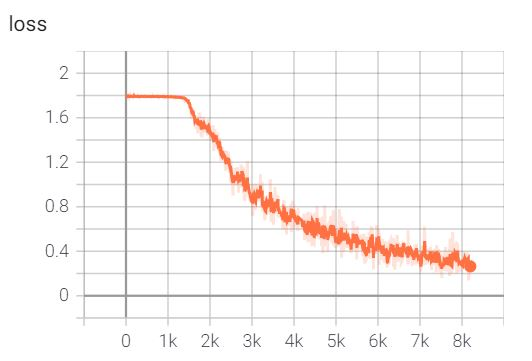
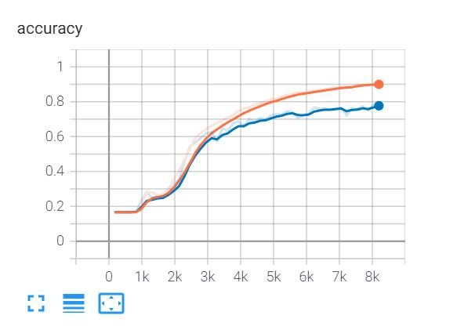
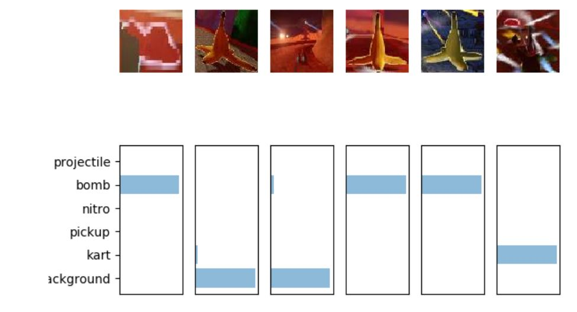

#


Here, I will train a convolutional network (CNN) to classify images from SuperTuxKart.

# 1 data source for training
The images took from SuperTuxKart computer game. We want to have the global-labeling for
six classes in the collection of our training data as below:
['background', 'kart', 'pickup', 'nitro', 'bomb', 'projectile']

```python
!https://www.cs.utexas.edu/~philkr/supertux_classification_trainval.zip
!https://www.cs.utexas.edu/~philkr/supertux_segmentation_trainval.zip
```

# 2 logging:
I use tensorboard forlogging. I created a dummy training procedure in logging.py, and two tb.SummaryWriter are 
provided as logging utilities. I used these summary writers to log the training loss at every iteration, the 
training accuracy at each epoch and the validation accuracy at each epoch. Here is a simple example of how to
use the SummaryWriter.
```python
import torch.utils.tensorboard as tb
logger = tb.SummaryWriter('cnn')
logger.add_scalar('train/loss', t_loss, 0)
```

In logging.py, use the summarywriter provided. We can test the logger by calling 
python3 -m homework.logging log, where log is your favorite directory. 
Then start up tensorboard: tensoboard --logdir log. 
Use python3 -m test homework -v to test the logging.

We used the follwing libraries:
```python
torch.utils.tensorboard.SummaryWriter
torch.utils.tensorboard.SummaryWriter.add_scalar
```

# 3 Train the CNN
We can train the model and save it as cnn.th. we can reuse some of the training 
functionality in train.py from classifier. We should incorporate the logging 
functionality (above) into your training routine. 

We can specify all the parameters specified in the [if __name__ == '__main__':] part of the train.py.
```python
!python3 -m classifier.train --log_dir .
```






After training is done, visualize the model's prediction using:
 ```python
 python3 -m calssifier.viz_prediction [DATASET_PATH]
```
After training, based on softmax classifier, we should be able to see images as below:

