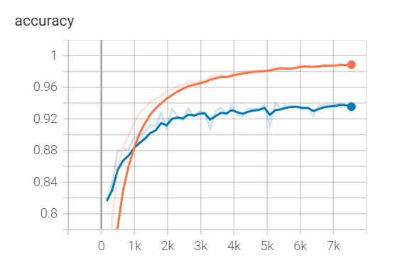
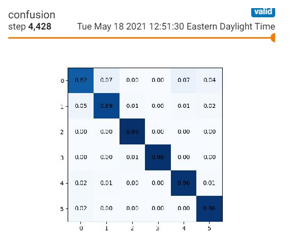
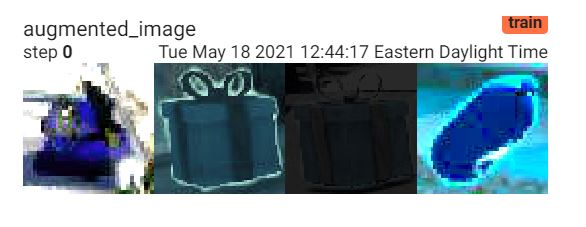

# Improved Accuracy of Classification
The accuracy of a classifier can be improved by implementing:

1) Input normalization
2) Residual blocks
3) Dropout
4) Data augmentations (Both geometric and color augmentations are important. Be aggressive here. Different levels of supertux have radically different lighting.)
5) Weight regularization
6) Early stopping

## 1 The Goal
The goal is to achieve a 94% accuracy with a training time of 10 GPU minutes. 


## 2 Reduce overfitting

### 2-1 Data Augmentation
The following library can be used to augment the data (training images)
```python
torchvision.transforms.Compose
torchvision.transforms.ColorJitter
torchvision.transforms.RandomHorizontalFlip

```
Debugging the utils.py helps to understand various transformation being done on the
training data.

In the train.py, we get parameters for transformation and augmentation of the 
input data:
```python
parser.add_argument('-t', '--transform',
                    default='Compose([ColorJitter(0.9, 0.9, 0.9, 0.1), RandomHorizontalFlip(), ToTensor()])')
```

The way we get the appropriate classes/object in train.py, by using the user input arguemnt through
the parsing the parameters:
```python
    import inspect
    transform = eval(args.transform,
                     {k: v for k, v in inspect.getmembers(torchvision.transforms) if inspect.isclass(v)})

    train_data = load_data('data/train', transform=transform, num_workers=4)
```
As seen above, when reading the train data, we just need to pass the transfromation we want
into our load_data method.


### mess up with the network
```python
torch.nn.Dropout
```

## 3 data for training
The following shows the location for training data for global labeling and dense
labeling. Here the fous is only to improve the accuracy of global labeling:
```python
!gdown https://drive.google.com/u/3/uc?id=1Gg-SblaraCKqypAKtmrGEO3wgR8uaYaL
!gdown https://drive.google.com/u/3/uc?id=1vwDx1VQeK2GJpSgW7TOulTZgB94AJ85t

!unzip -q supertux_classification_trainval.zip
!unzip -q supertux_segmentation_trainval.zip

!ls
```

## Some expected results:

It is expected the accuracy for training and test dataset should be similar below. As seen
the accuracy (validation set) improved significantly by applyting data augmentation:


Also, since this is a model for multi-class (6 class of data for global labeling),
confusion matrix is a tool that can help us how our classification works.
In train.oy, a piece of code is impemented to show the confusion matrix, as below:


Finally, apiece of code in train.py shows how an input image fortraining will change based 
on transformations we apply to the image:
  
