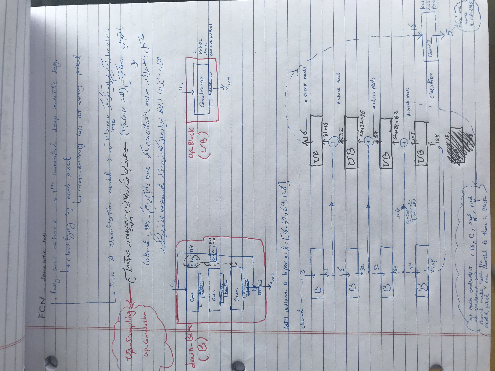

In this homework, we will implement an object detector from scratch.

The FCN network that Iused is depicted below:

The goal of our object detector is to find karts, bombs/projectiles, and pickup items. We'll use the same dataset and a similar starter code to homework 4. You'll also need to employ similar data augmentation to make detection work.

box

We will implement a point-based object detector. Your detector will represent each object by a single point at its center. This point is easy to detect by a dense prediction network, similar to HW3.

Point-based object detection
You'll take your segmentation network and repurpose it for object detection. Specifically, you'll predict a dense heatmap of object centers, as shown below:

heatmap

Each "peak" (local maxima) in this heatmap corresponds to a detected object. We start by implementing a function that extracts all local maxima (peaks) from a given heatmap.

Peak extraction
A peak in a heatmap is any point that is

a local maxima in a certain (rectangular) neighborhood (larger or equal to any neighboring point), and
has a value above a certain threshold.
Implement the extract_peak function in models.py to extract these local maxima. The input to extract_peak is a 2d heatmap, the output is a list of peaks with score, x and y location of the center of the peak. The score is the value of the heatmap at the peak, and is used to rank detections later. A peak with a high score is a more important detection.

Test your peak extractor using

python3 -m grader homework
Hint: There may be many peaks close to an object center. Only return local maxima (points that have a higher response that any point in their surrounding).

Hint: Implement local maxima detection using max pooling.

Hint: Max pooling expects an order-4 tensor as an input, use heatmap[None,None] to convert the input heatmap to an order-4 tensor.

Relevant Operations
torch.nn.functional.max_pool2d
torch.topk
and all previous
Next, we'll implement the detector. This involves several steps before you'll be able to grade any part of it: First, you need to design your detection model. Second, you'll need to train your model to predict the above heatmap. Third, you'll need to use extract_peak to extract objects. We only grade the final detections and no intermediate output.

CNN model
You model should take an image as an input and predict a heatmap for each object. Each heatmap is an independent 0-1 output map. The heatmap is zero almost everywhere, except at object centers. Use a model similar to your solution to HW3 or the master solution. Implement your model in Detector in models.py.

Hint: Use the sigmoid and BCEWithLogitsLoss

Hint: Implement __init__ and forward first, worry about detect and detect_with_size later.

Training your CNN
The training code for your detector in train.py will look quite similar to HW3. DetectionSuperTuxDataset loads the dataset. Unlike HW3, the annotations for this homework are not yet in a format that can be batched by pytorch. You can convert the detection annotations to a heatmap by calling the dense_transforms.ToHeatmap transform. ToHeatmap changes just the label and leaves the image unchanged. Call ToTensor to change the image. dense_transforms.py also contains several other annotations that you might find useful. utils.py shows how to use some of those transformations.

python3 -m homework.utils
It is highly recommended that you log your training using tensorboard.

Hint: Similar to HW3 the positive and negative samples are highly imbalanced. Try using the focal loss.

Relevant Operations
torch.nn.BCEWithLogitsLoss
and all previous
Object detection
The final step of your detector extracts local maxima from each predicted heatmap. Each local maxima corresponds to a positive detection. The function detect returns a tuple of detections as a list of five numbers per class (i.e., tuple of three lists): The confidence of the detection (float, higher means more confident, see evaluation), the x and y location of the object center (center of the predicted bounding box), and the size of the bounding box (width and height). Your detection function may return up to 100 detections per image, each detection comes with a confidence. You'll pay a higher price for getting a high confidence detection wrong. The value of the heatmap at the local maxima (peak score) is a good confidence measure. Use the extract_peak function to find detected objects.

Evaluation
We will evaluate your detector using average precision (AP). See here or here for a good explanation for average precision.

Average precision sorts all your detections (over the entire dataset) by their confidence. It then measures the precision (true positive / number of predictions) and recall (true positive / number of objects) for each class. Average precision is the mean precision at a recall of 0, 0.1, 0.2, ..., 1. We use two different criteria to determine if a detection is positive or negative:

Does a detection lie inside an object bounding box.
The distance between a detection and object center is smaller than or equal to 5px
The dataset contains quite a few small objects (smaller than 20px area). We ignore all small objects and do not penalize any predictions close to small objects.

Call the grader to compute your average precision

python3 -m grader homework
We will grade your assignment using the following rubric:

20% correct extract peak function
5% Correct output format of the detector
3 x 10% for performance of your detector for each of the three classes on the point-inside-box metric (AP 0.75 / 0.45 / 0.85 graded linearly from 0.25 below the required threshold).
3 x 15% for performance of your detector for each of the three classes on the center-distance metric (AP 0.75 / 0.45 / 0.85 graded linearly from 0.25 below the required threshold).
3 x 3% (extra credit) for designing a full object detector.
Warning: The validation set is significantly easier than the test set. Our master solution reaches a 0.820 / 0.609 / 0.894 validation AP on the point inside box metric, but only 0.741 / 0.531 / 0.887 test AP. To be on the save side make sure your solution surpasses the required AP by 0.1 .

Extra credit (9pts): Full object detection
You can earn some extra credit by implementing a full-fledged object detector. To do so you'll need to predict the size of the object in question. The easiest way to do this is to predict two more output channels, in addition to the 3-channel heatmap. We will evaluate AP at an intersection over union (overlap) of 0.5.

Hint: Make sure, to only apply the size loss at object centers.

Hint: Carefully balance the size and peak losses.

Grading
The test grader we provide

python3 -m grader homework -v
will run a subset of test cases we use during the actual testing. The point distributions will be the same, but we will use additional test cases. More importantly, we evaluate your model on the test set. The performance on the test grader may vary. Try not to overfit to the validation set too much.

Submission
Once you finished the assignment, create a submission bundle using

python3 bundle.py homework [YOUR UT ID]
and submit the zip file on canvas. Please double-check that your zip file was properly created, by grading it again

python3 -m grader [YOUR UT ID].zip
Online grader
We will use an automated grader through canvas to grade all your submissions. There is a soft limit of 5 submisisons per assignment. Please contact the course staff before going over this limit, otherwise your submission might be counted as invalid.

The online grading system will use a slightly modified version of python and the grader:

Please do not use the exit or sys.exit command, it will likely lead to a crash in the grader
Please do not try to access, read, or write files outside the ones specified in the assignment. This again will lead to a crash. File writing is disabled.
Network access is disabled. Please do not try to communicate with the outside world.
Forking is not allowed!
print or sys.stdout.write statements from your code are ignored and not returned.
Please do not try to break or hack the grader. Doing so will have negative consequences for your standing in this class and the program.

Running your assignment on google colab
You might need a GPU to train your models. You can get a free one on google colab. We provide you with a ipython notebook that can get you started on colab for each homework. Follow the instructions below to use it.

Go to http://colab.research.google.com/.
Sign in to your Google account.
Select the upload tab then select the .ipynb file.
Go to Runtime -> Change runtime type.
Select Python 3 and GPU as the hardware accelerator.
Click Save then Connect.
Follow the instructions on the homework notebook to upload code and data.

Honor code
This assignment should be solved individually.

What interaction with classmates is allowed?

Talking about high-level concepts and class material
Talking about the general structure of the solution (e.g. You should use convolutions and ReLU layers)
Looking at online solutions, and pytorch samples without directly copying or transcribing those solutions (rule of thumb, do not have your coding window and the other solution open at the same time). Always cite your sources in the code (put the full URL)!
Using any of your submissions to prior homework
Using the master solution to prior homework
Using ipython notebooks from class
What interaction is not allowed?

Exchange of code
Exchange of architecture details
Exchange of hyperparameters
Directly (or slightly) modified code from online sources
Any collaboration
Putting your solution on a public repo (e.g. github). You will fail the assignment if someone copies your code.
Ways students failed in past years (do not do this):

Student A has a GPU, student B does not. Student B sends his solution to Student A to train 3 days before the assignment is due. Student A promises not to copy it but fails to complete the homework in time. In a last-minute attempt, Student A submits a slightly modified version of Student B's solution. Result: Both students fail the assignment.
Student A struggles in class. Student B helps Student A and shows him/her his/her solution. Student A promises to not copy the solution but does it anyway. Result: Both students fail the assignment.

Student A sits behind Student B in class. Student B works on his homework, instead of paying attention. Student A sees Student B's solution and copies it. Result: Both students fail the assignment.

Student A and B do not read the honor code and submit identical solutions for all homework. Result: Both students fail the class.

Installation and setup
Installing python 3
Go to https://www.python.org/downloads/ to download python 3. Alternatively, you can install a python distribution such as Anaconda. Please select python 3 (not python 2).

Installing the dependencies
Install all dependencies using

python3 -m pip install -r requirements.txt
Note: On some systems, you might be required to use pip3 instead of pip for python 3.

If you're using conda use

conda env create environment.yml
The test grader will not have any dependencies installed, other than native python3 libraries and libraries mentioned in requirements.txt. This includes packages like pandas. If you use additional dependencies ask on piazza first, or risk the test grader failing.

Manual installation of pytorch
Go to https://pytorch.org/get-started/locally/ then select the stable Pytorch build, your OS, package (pip if you installed python 3 directly, conda if you installed Anaconda), python version, cuda version. Run the provided command. Note that cuda is not required, you can select cuda = None if you don't have a GPU or don't want to do GPU training locally. We will provide instruction for doing remote GPU training on Google Colab for free.

Manual installation of the Python Imaging Library (PIL)
The easiest way to install the PIL is through pip or conda.

python3 -m pip install -U Pillow
There are a few important considerations when using PIL. First, make sure that your OS uses libjpeg-turbo and not the slower libjpeg (all modern Ubuntu versions do by default). Second, if you're frustrated with slow image transformations in PIL use Pillow-SIMD instead:

CC="cc -mavx2" python3 -m pip install -U --force-reinstall Pillow-SIMD
The CC="cc -mavx2" is only needed if your CPU supports AVX2 instructions. pip will most likely complain a bit about missing dependencies. Install them, either through conda, or your favorite package manager (apt, brew, ...).

