# Semantic Labeling & Fully Convolutional Network (FCN)

In semantic labeling, we are looking for a couple of objects/classes within every 
image. Picture below shows how we can tag various objects within each image.

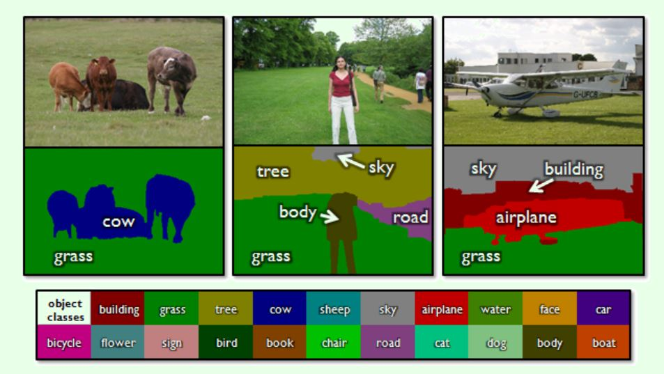

There is a difference (or similairty) between semantic labeling and instance labeling:
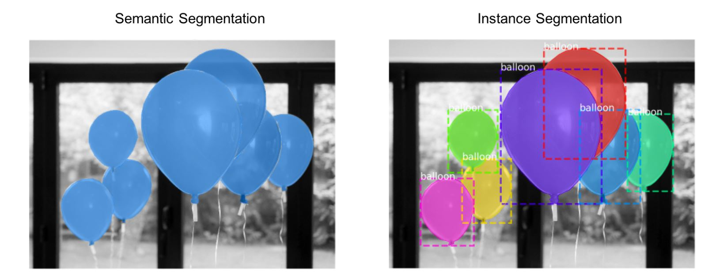

## 1 Accuracy in Semantic Labeling
The accuracy of a classifier (either CNN or FCN) will be improved by implementing:

1) Input normalization
2) Residual blocks in the model
3) Dropout
4) Data augmentations (Both geometric and color augmentations are important. Be aggressive here. Different levels of supertux have radically different lighting.)
5) Weight regularization
6) Early stopping

For the input normalization, we must do it within the __init__ method of our model, so every test
or valid data gets the same input normalization, otherwise it will get messed up:

```python
def __init__(self, layers=[16, 32, 64, 128], n_output_channels=5, kernel_size=3, use_skip=True):
    super().__init__()
    self.input_mean = torch.Tensor([0.3521554, 0.30068502, 0.28527516])
    self.input_std = torch.Tensor([0.18182722, 0.18656468, 0.15938024])
```

Similar to global labeling, we still use the confusion matrix (utils.py), but in 
semantic labeling we have to use IOU to define average and global accuracy. In the 
picture below, we want to semantically label the lady's picture. We can 
see the actual vs the prediction. The following image shows the intersection versus
the union that are used to define IOU (intersection over union). If IOU close to 1,
then a good prediction:

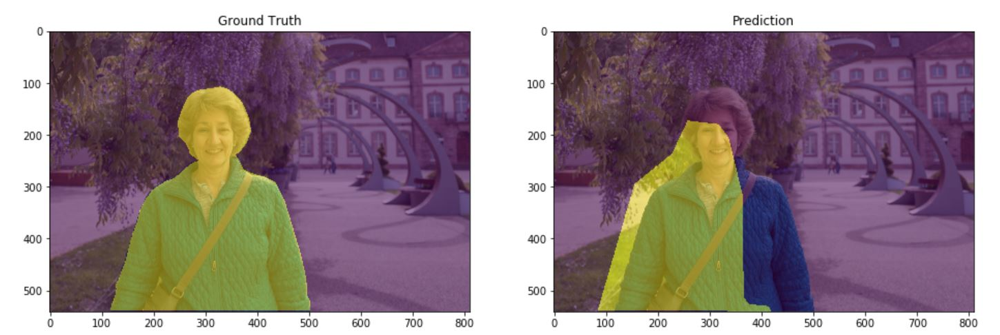

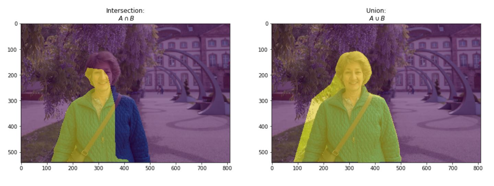

By using IOU concept, we can define a threshold below which we call if a false
positive. In the picture below the threshold is set to 0.5:

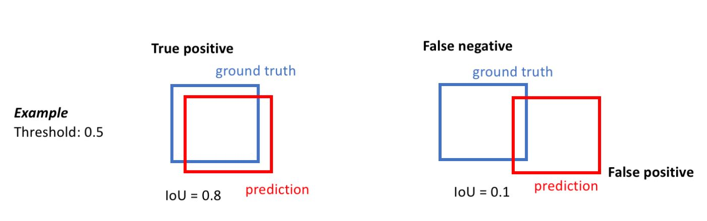


## 2 Fully Convolutional Network (FCN)
The goal is to achieve a high accuracy for a semantic (dense) labeling. 
For FCN model only convolutional operators are used: pad all of them correctly and 
match strided operators with up-convolutions. Skip and residual connections are used.

FCN handles an arbitrary input resolution and produces an output of the same shape as 
the input: using output_padding=1 if needed, or cropping the output if it is too large.
 


## 3 Reduce over-fitting
Similar to a CNN, FCN uses similar techniques to reduce over-fitting issue:

### 3-1 Data Augmentation
The following library can be used to augment the data (training images)
```python
torchvision.transforms.Compose
torchvision.transforms.ColorJitter
torchvision.transforms.RandomHorizontalFlip

```
Debugging the utils.py helps to understand various transformation being done on the
training data.

In the train.py, we get parameters for transformation and augmentation of the 
input data:
```python
parser.add_argument('-t', '--transform',
                    default='Compose([ColorJitter(0.9, 0.9, 0.9, 0.1), RandomHorizontalFlip(), ToTensor()])')
```

The way we get the appropriate classes/object in train.py, by using the user input arguemnt through
the parsing the parameters:
```python
    import inspect
    transform = eval(args.transform,
                     {k: v for k, v in inspect.getmembers(torchvision.transforms) if inspect.isclass(v)})

    train_data = load_data('data/train', transform=transform, num_workers=4)
```
As seen above, when reading the train data, we just need to pass the transfromation we want
into our load_data method.


### 3-2 mess up with the network
```python
torch.nn.Dropout
```


## 4 FCN training
In FCN training, the DenseSuperTuxDataset dataset is used. This is a training dataset
that has pixel-level labels for images taken from SuperTux computer-game. This dataset
accepts a 
data augmentation parameters transform. Most standard data augmentation in torchvision 
do not directly apply to dense labeling tasks. A smaller subset of useful augmentations
are provided that properly work with a pair of image and label in dense_transforms.py.


## 5 Source of semantic data for training
The following shows the location for training data for global labeling and dense
labeling. Here the fous is only to improve the accuracy of global labeling:
```python
!gdown https://drive.google.com/u/3/uc?id=1Gg-SblaraCKqypAKtmrGEO3wgR8uaYaL
!gdown https://drive.google.com/u/3/uc?id=1vwDx1VQeK2GJpSgW7TOulTZgB94AJ85t

!unzip -q supertux_classification_trainval.zip
!unzip -q supertux_segmentation_trainval.zip

!ls
```

## 6 Focal loss
Since the training set has a large class imbalance, it is easy to cheat in a pixel-wise
accuracy metric. 
In utils.py, the distribution of each class in the training dataset mentioned:
```python
DENSE_LABEL_NAMES = ['background', 'kart', 'track', 'bomb/projectile', 'pickup/nitro']
# Distribution of classes on dense training set (background and track dominate (96%)
DENSE_CLASS_DISTRIBUTION = [0.52683655, 0.02929112, 0.4352989, 0.0044619, 0.00411153]
```
As seen above, predicting only track and background gives a 96% accuracy. loss function
is defined with the following weight:

```python
w = torch.as_tensor(DENSE_CLASS_DISTRIBUTION)**(-args.gamma)
loss = torch.nn.CrossEntropyLoss(weight=w / w.mean()).to(device)
```

## 7 IOU (intersection over union)
As seen above, loss might not be a good measure in an unbalanced semantic labeling.
Additional measure for  the Intersection-over-Union (IOU) evaluation metric is provided.
This is a standard semantic segmentation metric that penalizes largely imbalanced 
predictions. 

## 8 Some expected results:

Here the confusion matrix is defined for five classes that we are intending doing our
semantic labeling in each picture.
The average IOU (in the diagonal of the confusion matrix), and the subsequent average and global 
accuracy is depicted below:

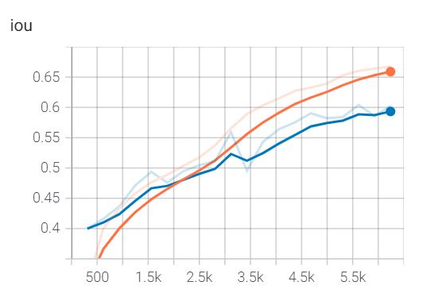

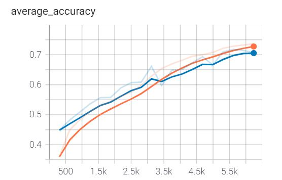

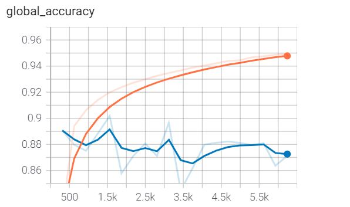

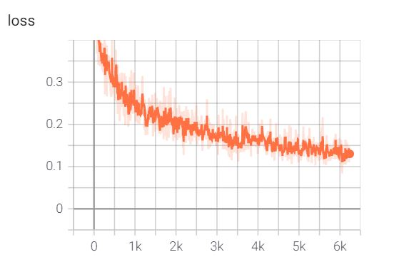

And for the images, below shows the original image, the labeled image used for traning, and the last one shows
the predicted semantic label for this picture.

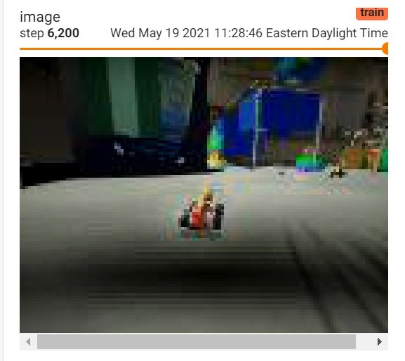

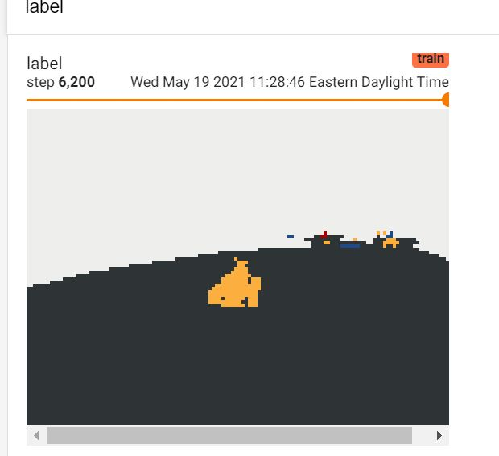

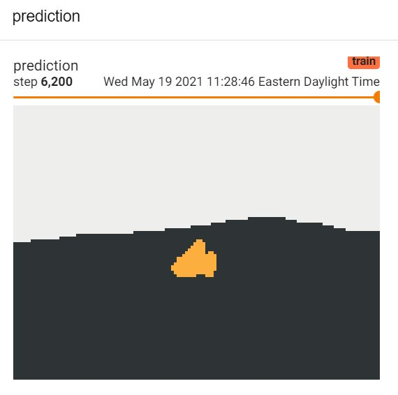


# 8 Reference for Semantic Lableing
https://www.jeremyjordan.me/evaluating-image-segmentation-models/

